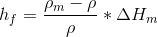
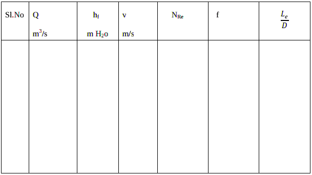

#### Apparatus required :

CCL4 manometer, Hg manometer.

#### Procedure :
<ol style="text-align: justify; list-style-type: number;">
 <li>Keep the valve leading to fittings open and valves leading to other lines closed.</li>
 <li>Keep the bypass valve completely open and the main valve completely closed. Switch on
the pump.</li>
 <li> Connect a CCLmanometer to the pressure taps across the globe valve. Ensure that no air
bubbles present and height in both the limbs of manometer are the same.</li>
 <li>Set a flow rate of water through the pipe by opening the main valve and throttling the
bypass valve suitably using the rotameter.</li>
 <li>Note down the rotameter reading and manometer reading after a steady state is attained.</li>
 <li>Increase the flow rate of water by opening the main valve and throttling the bypass valve
suitably and repeat step 4 and 5.</li>
 <li>Use mercury manometer for higher flow rates.</li>
 <li>Take eight readings with CCL4 manometer as well as with Hg  manometer.</li>
</ol>

#### Data :

Diameter of the pipe connected to globe valve = D =&nbsp;&nbsp;&nbsp;&nbsp;&nbsp; m  
Density of water =  =&nbsp;&nbsp;&nbsp;&nbsp;&nbsp;kg/m 

Viscosity of water = =cp=&nbsp;&nbsp;&nbsp;&nbsp;&nbsp;kg/ms  

Density of CCl4 = 1600 kg/m 
Density of Hg = 13600 kg/m 

#### Calculations :

<ol>
 <li>Flow rate:</li>
 <li> ∆Hm is cm of manometric fluid:</li>
 <li>Volumetric flow rate, Q =m3/s</li>
 <li>Pressure drop in m of water hf = </li>
 <li>Cross sectional area of the pipe A = </li>

 <li>Average velocity through the pipe = V=Q/A =  &nbsp; m/s</li>
<li> Reynolds number </li>
 <li>Friction factor f is calculated using f = </li>
 <li>Equivalent length of Globe valve:</li>
 </ol>  

<table></table>

##### Result :
Report equivalent length of the fitting and compare with other types.
