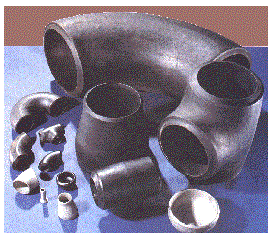
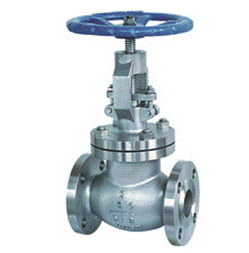
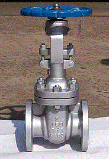
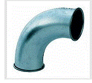
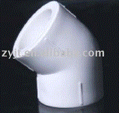
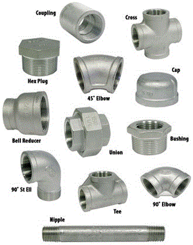
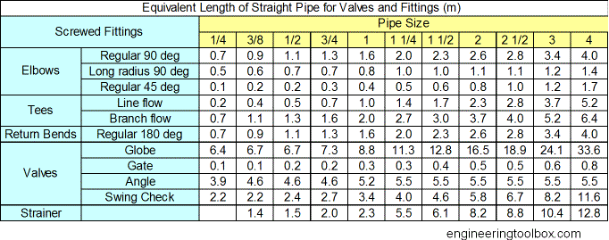
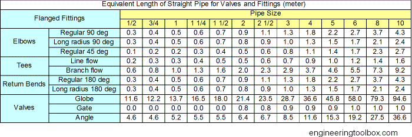

### Background and Theory

One of the most common problem in fluid mechanics is the estimation of
pressure loss. Calculating pressure losses is necessary for determining the
appropriate size pump.
Knowledge of the magnitude of frictional losses is of
great importance because it determines the power requirements of the pump
forcing the fluid through the pipe. For example, in refining and petrochemical
industries, these losses have to be calculated accurately to determine where booster
pumps have to be placed when pumping crude oil or other fluids in pipes to
distances thousands of kilometres away.

Pipe losses in a piping system result from a number of system characteristics,
which include among others; pipe friction, changes in direction of flow,
obstructions in flow path, and sudden or gradual changes in the cross-section and
shape of flow path.

Whenever the velocity of a fluid is changed, either in direction or magnitude, by a
change in the direction or size of the conduit, friction additional to the skin friction
from flow through the straight pipe is generated. Such friction includes form
friction resulting from vortices which develop when the normal streamlines are
disturbed and when boundary-layer separation occurs. The form friction is due to
the obstructions present in the line of flow, it may be due to a bend or a control
valve or anything which changes the course of motion of the flowing fluid.

Fittings and valves also disturb the normal flow lines and cause friction. In short
lines with many fittings , the friction loss from the fittings may be greater than that
from the straight pipe.

As in straight pipe, velocity increases through valves and fittings at the expense of
head loss. This can be expressed by equation similar to Equation 1:

</img>&nbsp;&nbsp;&nbsp;&nbsp;&nbsp;&nbsp;(1)
 

Where V is the average velocity of the pipe leading to fitting.
Ke is called the resistance coefficient and is defined as the number of velocity
heads lost due to the valve or fitting. It is a measure of the following pressure
losses in a valve or fitting:

<ul style="list-style-type: circle;">
<li>Pipe friction in the inlet and outlet straight portions of the valve or fitting</li>
<li>Changes in direction of flow path</li>
<li>Obstructions in the flow path</li>
<li>Sudden or gradual changes in the cross-section and shape of the flow path</li>
</ul>

Pipe friction in the inlet and outlet straight portions of the valve or fitting is very
small when compared to the other three. Since friction factor and Reynolds
Number are mainly related to pipe friction, Ke can be considered to be independent
of both friction factor and Reynolds Number. Therefore, Ke is treated as a constant
for any given valve or fitting under all flow conditions, including laminar flow.
Indeed, experiments showed1 that for a given valve or fitting type, the tendency is
for Ke to vary only with valve or fitting size.

Pressure losses in fittings is usually represented by equivalent length( Leq). It is is
the length of a straight pipe that offers same resistance to flow as that offered by
the fitting. The ratio L/D is equivalent length in pipe diameters of straight pipe that
will cause the same pressure drop or head loss as the valve or fitting under the
same flow conditions.
The ratio Leq/D
 is equivalent length in pipe diameters of straight pipe that will
cause the same pressure drop or head loss as the valve or fitting under the same
flow conditions.
Friction loss from different fittings in a pipeline ,must be accounted for when
calculating friction losses for each section of pipe. Add the equivalent length of
pipe for each fitting or valve that occurs in each section of the pipeline.

##### Fittings :

 

##### Globe valve :

 

##### Gate Valve :

 

##### 90 degree Bend :

 

##### 45 degree elbow :

 

 

##### Screwed Fittings - equivalent length in meter :
Equivalent length (in meters) of straight pipe for fittings like bends, returns, tees and valves. 

 

##### Flanged Fittings - equivalent length in meter :
Equivalent length (in meters) of straight pipe for fittings like bends, returns, tees and valves.

